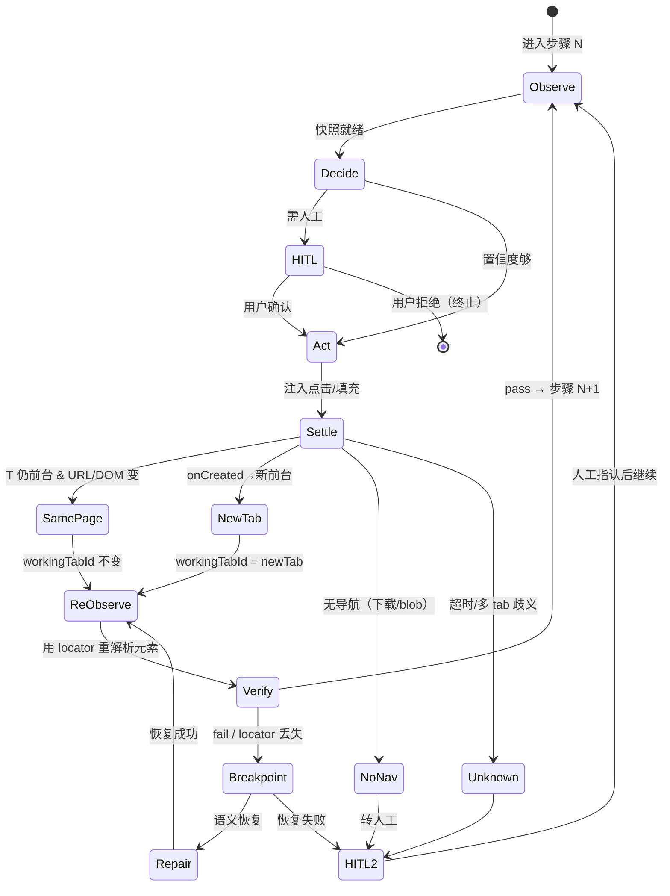

# JEV Web Control · Chrome 扩展（MV3）设计文档

> 状态：设计稿 v1（待评审）
> 背景：原方案是「Node 本地面板 + CDP 远程驱动 headless Chrome」（`server.mjs` + `public/index.html`）。用户反馈感知弱、且多标签页串联困难，决定改为 **Chrome 扩展（MV3）** 形态——在用户真实浏览器会话内运行，overlay 实时画在页面上，多标签页由 `chrome.tabs` 原生管理。

---

## 1. 为什么从 Node 面板转向扩展

| 维度 | 原 Node 面板方案 | 扩展方案（MV3） |
|------|----------------|----------------|
| 运行位置 | 浏览器外，CDP 远程控制 headless Chrome | 浏览器内，真实会话 |
| 元素可视化 | 截图 + 叠加框（iframe 错位，仅列表） | 页面内实时 overlay（DOM 层，天然对齐） |
| 多标签页 | 无概念，单 tab 假设 | `chrome.tabs` 一等公民，原生捕获 `onCreated`/`onUpdated` |
| 跨域 iframe | CDP 读不到跨域 frame 内容 | content script + `all_frames` 可注入跨域 frame |
| 登录态 | 无（headless 未登录） | 直接用用户已登录的 Salesforce / SAP / 内部系统 |
| 依赖 | Node 22 自带 WS+fetch + 持久化 Chrome | 纯扩展 API，零外部依赖 |

结论：**扩展形态同时解决了「感知弱」和「多标签页串联」两个痛点**，且能直接对企业内复杂应用（需登录）工作。

---

## 2. 整体架构

```mermaid
flowchart TB
  subgraph UI["侧边栏 / 弹窗 (Side Panel)"]
    U1[目标/URL 输入]
    U2[元素树·作用域徽章]
    U3[定位器详情+复制]
    U4[校验 spec 编辑器]
    U5[HITL 确认/拒绝]
  end

  subgraph BG["Background Service Worker"]
    B1[流程状态 {workingTabId, steps}]
    B2[标签页切换解析器]
    B3[decide + policy 安全层]
    B4[repair 断点恢复]
  end

  subgraph CS["Content Script（每个 frame 注入）"]
    C1[主框架 top frame]
    C2[iframe / Shadow 框架]
    C1a[穿透快照]
    C1b[实时 overlay]
    C1c[act 点击/填充]
  end

  UI <-->|消息协议| BG
  BG <-->|tabs.sendMessage| CS
  CS -->|直接读写| DOM[(真实 DOM / Shadow / 跨域 iframe)]
```

- **UI 层**：侧边栏（`side_panel` API）比 popup 更合适——持久、面积大、能展示元素树与步骤进度。
- **Background**：唯一"大脑"，持有跨标签页的流程状态，负责决策、策略、修复、标签页切换判定。
- **Content Script**：`manifest` 中 `content_scripts` 设 `all_frames: true`，每个 frame（含跨域 iframe）各注入一份；主框架负责汇总快照、画 overlay、执行动作。

---

## 3. 核心数据模型

```js
// 一个自动化流程
Flow = {
  id: string,
  goal: string,                 // 自然语言总目标
  workingTabId: number,         // ★ 当前工作标签页（可变，不绑定固定 tab）
  steps: Step[],                // 已执行/待执行步骤
  status: 'idle'|'observing'|'await_hitl'|'acting'|'broken'|'done'
}

// 单步
Step = {
  index: number,
  locator: Locator,             // durable locator（跨刷新/换页稳定）
  action: 'click'|'fill'|'select'|'wait',
  value?: string,               // fill 用
  spec?: VerifySpec,            // 本步完成后校验
  hitl: boolean,                // 是否需人工确认
  result?: { ok: boolean, verify: VerifyResult[] }
}

// Durable Locator（复用 snapshot_extended.js 的合成逻辑）
Locator = {
  scope: string,                // ""=主文档, "div#shadow-host::shadow/", "iframe[0]/"
  strategies: [                 // 按可靠性排序，resolve 时自上而下试
    { type:'semantic', role, name },
    { type:'css', selector:'#id' },
    { type:'css', selector:'[data-testid=...]' },
    { type:'css_path', selector:'body > div:nth-child(3) > button' }
  ]
}
```

**关键不变式**：`workingTabId` 是流程对"此刻该操作哪个 tab"的唯一真相来源。所有 observe / act 都作用在 `workingTabId` 上。

---

## 4. 步骤串联机制（同页 vs 新标签页）—— 核心

这是用户最关心的问题。两种跳转用**同一套机制**兜住，差异只在"哪个 tab 成为 `workingTabId`"。



### 4.1 Settle 检测器（后台监听）

执行 `act` 前记录 `beforeTabId`、`beforeUrl`，并"布防"监听器：

- `chrome.tabs.onCreated`：若 `tab.openerTabId === beforeTabId` 且新 tab 变为前台 → **新标签页**路径。
- `chrome.webNavigation.onCommitted` / `onDOMContentLoaded`：
  - 落在 `beforeTabId` 且 URL 变化 → **同页跳转**（整页刷新 / 服务端路由）。
  - 落在某个新 `tabId` 且为前台 → **新标签页**路径。
- **SPA / AJAX 局部刷新**：无导航事件。由 content script 用 `MutationObserver` 监听 DOM 变动，连续 N 毫秒（如 800ms）无变更即"静默期"达标 → 判定为**同页（未离开 T）**。
- 超时（如 8s）无明确信号或一次点击开多个 tab → `Unknown` → 转 HITL 让用户指认 continuation tab。

### 4.2 多新标签页处理

点击可能同时开"真目标 + 弹窗广告"多个 tab。判定 continuation tab 的优先级：
1. 命中本步 `locator` 预期 URL / `spec` 中声明的目标域名；
2. 与点击元素 `href`/`onclick` 推导目标最匹配者；
3. 其余标记为噪声 tab（可自动静音/关闭或仅标注）。

### 4.3 重解析（re-observe + resolve）

无论走哪条分支，下一步都 `observe(workingTabId)` → 用 `Locator.resolve()` 在新 DOM 上重新找元素：
- 找到 → 继续；
- 找不到 → 进入 `Breakpoint`，走 `repair`（语义身份恢复，跨 scope 搜索）→ 仍失败则 HITL。

**这就是"串联"的本质**：`workingTabId` 把"页面刷新"和"换标签页"两种页面身份变化，统一成"换了个 DOM 重新解析一遍 locator"。定位器是唯一稳定黏合剂。

---

## 5. 快照与穿透（复用现有实现）

直接复用 `scripts/snapshot_extended.js` 的采集核心，作为 content script 注入页面：

- `collectCandidates(rootDoc, scopePrefix, out)`：递归穿透 open Shadow Root + 同/跨源 iframe（扩展下可进跨源 frame），为每个候选打 `scope` 标签（`""` / `::shadow/` / `iframe[i]/`）。
- `locatorOf(el)`：合成 durable locator（semantic > css-id > css-path）。
- `resolve(locator, doc)`：在新 DOM 上重找元素（实现 4.3 的重解析）。
- `evaluateSpec(spec, doc)`：声明式校验（第 8 节）。

注入方式：background 用 `chrome.scripting.executeScript` 把 `snapshot_injected.js` 注入目标 frame；或在 `manifest` 的 `content_scripts` 中声明自动注入。

---

## 6. 决策 / 策略 / 修复 的移植

现有 Python 逻辑**照搬算法、改语言**为 background 内 JS（浏览器跑不了 Python）：

| 现有文件 | 扩展位置 | 说明 |
|---------|---------|------|
| `scripts/decide.py` | `lib/decide.js` | 双 provider（mock / TypeSafe / OpenRouter）→ 移植为 JS；mock 按关键词重叠打分 |
| `scripts/policy.py` | `lib/policy.js` | 敏感词 / 低置信 → 强制 HITL；deny / allow_origins |
| `scripts/repair.py` | `lib/repair.js` | 旧 plan locator 对新快照 diff，语义恢复，失败标 needs_human |
| `scripts/locator.py` | 合入 `lib/locator.js` | `resolve_offline` → 改为页面内 `resolve` |
| `scripts/verify.py` | `lib/verify.js` | `evaluateSpec` 纯函数，几乎直译 |

判定规则、置信度阈值、作用域语义全部保留。

---

## 7. HITL 人机协同

- 触发条件（任一即阻断，等人工）：策略层命中敏感词 / 置信度 < `minConfidence` / 新标签页且多 tab 歧义 / 断点恢复失败。
- 面板展示：目标 → 决策（选中的元素 + 置信度 + 是否需人工）→ 「确认执行」/「拒绝」。
- 确认后 background 调 content script 真实执行并刷新；拒绝则终止或回退上一步。

---

## 8. 声明式校验（VerifySpec）

沿用 `snapshot_extended.evaluateSpec`，规则类型：
- `url_matches` / `url_regex`
- `text_contains`
- `element_present`（按 name/role/定位器）
- `field_value`（表单字段值校验）

面板里贴 JSON spec，实时跑，逐条 pass/fail 芯片展示。

---

## 9. 权限与 manifest（MV3）

```json
{
  "manifest_version": 3,
  "name": "JEV Web Control",
  "permissions": ["tabs", "activeTab", "scripting", "storage", "sidePanel"],
  "host_permissions": ["<all_urls>"],
  "background": { "service_worker": "background.js" },
  "content_scripts": [{
    "matches": ["<all_urls>"],
    "js": ["content/content.js"],
    "all_frames": true,
    "run_at": "document_idle"
  }],
  "side_panel": { "default_path": "sidepanel/panel.html" },
  "action": { "default_title": "打开 JEV Web Control" }
}
```

> 企业内应用时，`host_permissions` 可收窄到内网域名；`all_frames` 是穿透 iframe 的关键。

---

## 10. 与现有代码的迁移映射

```
jev-webcontrol/
├─ scripts/
│  ├─ snapshot_extended.js   → extension/content/snapshot_injected.js  (采集+定位器+resolve)
│  ├─ decide.py              → extension/lib/decide.js
│  ├─ policy.py              → extension/lib/policy.js
│  ├─ repair.py              → extension/lib/repair.js
│  ├─ verify.py              → extension/lib/verify.js
│  ├─ locator.py             → 合入 extension/lib/locator.js
│  ├─ live_cdp.mjs           → （弃用，被 content script 取代）
│  └─ ...
├─ server.mjs / public/      → （弃用，被扩展 UI 取代，可保留作离线演示）
└─ extension/                ← 新增
   ├─ manifest.json
   ├─ background.js          （流程状态 + 标签页切换解析器 + 调 lib/*）
   ├─ content/
   │  ├─ content.js          （注入逻辑：调度 snapshot_injected，画 overlay，act）
   │  └─ snapshot_injected.js
   ├─ lib/                   （decide/policy/repair/verify/locator）
   └─ sidepanel/             （panel.html/js/css）
```

---

## 11. 实施里程碑

- **M1' 骨架**：`manifest.json` + 空 background + content 注入；加载扩展能跑通 `OBSERVE` 返回主文档快照。
- **M2' 穿透**：Shadow + iframe 多 scope 快照，overlay 实时高亮（主文档蓝 / Shadow 紫）。
- **M3' 决策链路**：decide + policy 移植；HITL 确认后真实 act。
- **M4' 校验**：verify 面板贴 spec 在线跑。
- **M5' 串联（重点）**：settle 检测器 + 标签页切换解析器；`workingTabId` 交接；同页 / 新标签页两条分支跑通；多 tab 歧义转 HITL。
- **M6' 修复**：断点语义恢复；生成 skill 包（沿用 `package.py` 思路，输出可直接用的自动化方案）。

---

## 12. 边界与风险

- **跨域 iframe 内的 act**：content script 能读能注入，但跨源 frame 内的真实点击需在该 frame 上下文执行（`chrome.scripting` 指定 `frameId`）；坐标 overlay 仍可能因跨文档坐标系错位，需做 frame 内相对坐标换算。
- **下载 / blob / `window.open` 无导航**：归为 `NoNav`，转 HITL 或查 `chrome.downloads`。
- **SPA 静默期阈值**：不同应用 DOM 稳定时间不同，阈值做成可配置（默认 800ms）。
- **多账号/多窗口**：`workingTabId` 仅跟踪单流程单窗口；跨窗口流程需额外扩展（暂不在 v1）。

---

## 13. 待确认问题

1. 侧边栏 vs 弹窗：默认侧边栏，是否同意？
2. `host_permissions` 是否先 `<all_urls>` 通配，还是按企业内网域名收窄？
3. 是否保留 `server.mjs` + `public/` 作为离线演示，还是本次直接弃用？
4. decode/TypeSafe/OpenRouter 真实 key 何时接入（mock 先用着）？

---

_评审通过后进入 M1' 编码。_
