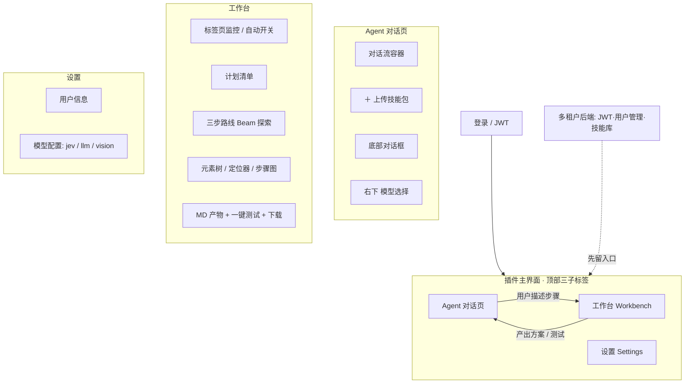
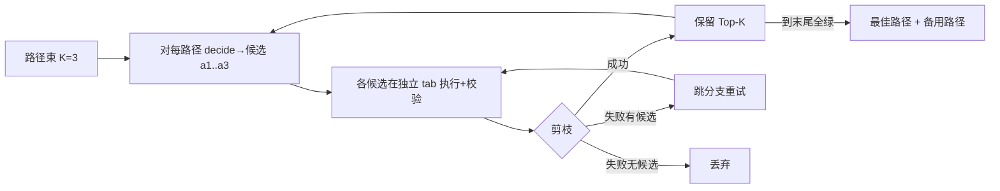

# JEV Web Control · 插件产品形态设计（草稿）

> 状态：产品形态 v0.1（设想 + 发散，待评审）
> 与《扩展设计文档.md》的关系：那篇是**底层引擎**（快照穿透 / durable locator / decide / policy / repair / HITL / 校验 / 多标签页串联）；本篇是**产品形态层**（用户看到什么、怎么用、怎么卖/协作）。引擎是"怎么做"，本篇是"做什么、为谁做"。

---

## 0. 一句话定位

> 一个**登录后即用的浏览器插件**：用户用自然语言描述网页自动化步骤，插件监控/打开对应标签页，**以"三步探索 + 最佳路径搜索"自动跑出最稳的自动化路线**，产出一份**Agent 可直接消费的结构化 MD 方案**，一键测试后可下载保存为可复用技能包。多租户 / 用户后台为可后置的企业能力，先留入口。

---

## 1. 总体信息架构

---

## 2. 多租户 / 后端（先留入口，可后置）

> 用户原话："多租户系统（可先不做，留个入口）"。因此设计为**可插拔**：插件核心在"本地模式"即可完整运行；后端是叠加的企业能力。

**2.1 身份认证（JWT）**
- 登录拿 JWT，存 `chrome.storage.session`（不落盘明文）；过期用 refresh token 续期。
- 后端接口：`POST /auth/login`、`POST /auth/refresh`、`GET /auth/me`。

**2.2 用户管理后台**
- 租户（org）→ 用户（role: owner/admin/member/viewer）→ 权限。
- 后台页面（独立 Web）：用户增删、角色、API Key 管理、用量统计。
- 插件侧只需"我的信息 + 登出"，重管理放后台 Web。

**2.3 与插件的接口**
- 技能包存储：`GET/POST /skills`（上传的 skill 包存云端，跨设备/跨人复用）。
- 模型代理：`POST /v1/decide`、`POST /v1/plan`（把 jev/llm 调用收口到后端，避免把 key 暴露在前端；本地模式则直连）。
- 协作/审阅：计划可被团队"发布到技能库"并带审阅流。

**2.4 本地模式（无后端）**
- 所有数据存 `chrome.storage.local`；技能包存本地；模型直连用户配置的 endpoint。
- 企业内网 / 强隐私场景首选。后端入口以 `settings.backendUrl` 为空时自动切本地。

---

## 3. 插件形态：三大子标签

### 3.1 Agent 对话页
- **对话流容器**：类 ChatGPT/Claude 的会话流，左/上为主。Agent 负责把自然语言步骤解析成结构化 Plan，并把执行状态流式回填到对话流。
- **底部左下 ＋**：上传用户已有 skill 技能包（`.zip` / `.md` / WorkBuddy Skill），作为**可复用步骤模板**或直接导入为初始 Plan。
- **底部中间对话框**：主输入。可输入"打开百度，搜 xxx，点第一条"这类自由文本，也可 @ 引用已上传技能。
- **底部右下模型选择**：选本次对话用的 LLM（见 §4.7 模型路由）。

### 3.2 工作台（核心）
见第 4 节专门展开——这是产品差异化的重心。

### 3.3 设置页
- **用户信息**：昵称、租户、登出。
- **模型配置**：
  - **jev 模型**：高速"选择/决策"小模型（TypeSafe 类），负责每一步"选哪个元素、走哪条候选"，毫秒级、低成本。
  - **llm 模型**：通用大模型，负责把自然语言步骤 → Plan、生成 MD、做语义修复。
  - （发散）**vision 模型**：可选，用于理解截图/步骤图，处理纯视觉判断（如"验证码""弹窗样式"）。

---

## 4. 工作台详解 + 我对"三步路线"的澄清与增强

### 4.1 标签页监控与自动开关
- 用户输入步骤后，自动切到工作台。
- 工作台读 `chrome.tabs.query`，把每个打开标签的 `title`/`url` 与用户描述的"目标站点"做语义匹配：
  - **命中**：直接在命中的标签页上开始自动化。
  - **未命中**：自动 `chrome.tabs.create` 新标签并导航到目标 URL（如百度）。
  - 多个候选命中 / 需要登录：提示或 HITL 选择。

### 4.2 计划清单（Plan）生成
- LLM 把 NL 步骤解析为有序 Plan：`[s1:打开百度, s2:搜索xxx, s3:点击查询, s4:点第一条帖子]`。
- 每步含：意图、预期页面信号（用于校验）、可能的前置条件。
- Plan 展示为可编辑清单（用户可增/删/改/重排，非完全黑盒）。

### 4.3 "三步路线"的精确定义：Beam Search（宽度 K，默认 3）
> 你的描述我理解为**带回溯的束搜索（beam search）**，不是简单的"三步窗口"。下面是我对你的设想的**澄清 + 改进**，请确认是否符合本意。

- **路径（Path）** = 一条具体的已执行轨迹：`[(意图, 选用定位器, 动作, 观察, 校验结果), ...]`。
- 维护一个**宽度 K=3 的活动路径束**（你看到的"三个标签"，标签文字=路径/步骤序号）。
- 每一步推进：
  1. 对每条活动路径，在**当前页面状态**上调 `decide(状态, 下一步意图)` → 返回**按可靠性排序的候选动作** `[a1, a2, a3…]`。
  2. 把该路径扩展出最多 K 个后继（每个试一个不同候选），在**各自的标签**里执行该候选、观察 + 校验。
  3. 推进完一步后**剪枝**：
     - 校验失败 → 标 broken；若该步还有未试候选 → **跳到它的分支**（换候选重试）；候选耗尽 → 丢弃该路径。
     - 校验成功 → 保留。
  4. 按评分保留 Top-K，继续推进，直到某路径到达 Plan 末尾且全绿 → 成为**完成路径**。
- "执行到第二步会自动算第四步" = 前瞻（lookahead）：step2 稳定后即对 step4 的候选做预计算，属正常推进，不额外特殊。
- 最终返回**评分最高的完成路径**为"最佳路线"；Top-K 一并保留为**主路径 + 备用路径**。
- K 是**配置项**（默认 3，不是写死），复杂页面可调到 5。

### 4.4 元素树 / 定位器 / 步骤图（逐步产出）
- 每条路径每推进一步，从 content script 取：元素树（按 `主文档/::shadow/iframe` 作用域分组）、选中元素 durable locator（按可靠性排序）、校验结果。
- **步骤图**：把每步的"动作 + 定位器 + 页面信号 + 校验"渲染成时间线/卡片，可回放（见 §5 可观测）。

### 4.5 MD 产物（Agent 可直接消费）
- 产出一份结构化 MD，格式面向"下一个 Agent 能立刻复现最佳路线"优化：
  - 元信息（站点、生成时间、模型、K 值）。
  - 逐步 Plan：每步 = 意图 + **首选定位器（含策略优先级）** + 动作 + 校验 spec + 备选定位器（fallback）。
  - 备选路径摘要（主路径失效时自动回退用）。
  - 已知脆弱点 / 需 HITL 的步骤。
- 这与《扩展设计文档》中 `package.py` 产出的 SKILL.md 同源——MD 是给 Agent 读的"运行手册"。

### 4.6 一键测试 + 下载保存
- **一键测试**：用最佳路径（含 durable locator 重解析）在真实标签重放；任一步 locator 漂移则自动回退备选路径（接 repair）。
- **下载保存**：导出多格式（见 §6.8）——MD（Agent 用）、可执行 replay 脚本、WorkBuddy Skill、Playwright/JSON。

---

## 5. 我对设想的发散与增强（重点）

以下是对你原设想**主动补充**的点，挑有价值的列：

**5.1 探索 vs 提交（安全，最重要）**
- 三步并行探索若"真点真填"，会有副作用（提交表单、发帖）。建议：**探索阶段只做观察 + 可逆操作**，不可逆动作（提交/支付/发送）只在"最佳路径被确认后"执行，且仍过 HITL。即探索=找路，提交=走选定路。

**5.2 最佳路径的明确定义（评分）**
- 评分 = 成功率 + 定位器稳健度（semantic > id > css-path）+ 决策置信度 + 步骤数（越短越好）+ 副作用风险（越低越好）。Top-K 全留，运行时按序回退。

**5.3 运行时回退 / 自愈**
- MD 存主路径 + 备用路径。重放时主路径某步 locator 失效 → 自动切备用（接 repair.py 的语义恢复）；都失效 → HITL。让"测出来的最佳路线"长期可用。

**5.4 版本 / Diff / 回归**
- 目标站点改版后，重跑并与旧 MD diff，标"哪步变了、定位器是否迁移成功"。可设**定时回归**：每周自动验证一次，静默失败才告警。把"一键测试"升级成"持续可信"。

**5.5 可观测与回放**
- 每次运行记录 trace（每步截图、DOM 快照、用的定位器、校验结果）→ 可逐步回放/调试。步骤图即来自 trace。

**5.6 协作 / 审阅 / 技能库**
- 配合多租户后端：计划可"发布到团队技能库"并带审阅流；他人可复用、评分、提 issue。＋上传与库下载形成闭环。

**5.7 模型路由（不止 jev/llm）**
- jev（选择/决策，快省）+ llm（NLU/规划/MD，强）+ **vision（可选，看图）** 三层。按任务自动路由；设置里可分别配 endpoint、开关、默认模型。

**5.8 导出多格式**
- 除 MD 外，下载时给：可执行 replay 脚本、WorkBuddy Skill、Playwright/JSON、n8n 节点配置。一份路线，多处复用。

**5.9 计划可编辑 + HITL 粒度**
- Plan 生成后用户可手改；HITL 粒度可配：每步确认 / 仅低置信确认 / 全自动。企业场景默认"低置信 + 不可逆动作"才拦。

**5.10 隐私与本地优先**
- 默认本地模式，数据不出浏览器；后端仅当用户主动配置 `backendUrl` 才启用。敏感站点绝不外传 DOM。

---

## 6. 端到端示例（你的百度例子走一遍）

1. Agent 页输入："打开百度，搜 xxx，点查询，点第一条帖子"。
2. 解析为 Plan `[s1 开百度, s2 搜xxx, s3 点查询, s4 点首条]`；自动切工作台。
3. 监控标签：无百度 → 新建 `baidu.com` 标签并导航。
4. 从 s1 起跑 Beam(K=3)：s1 候选（点击搜索框/地址栏直接搜/书签）→ 3 路径各试，校验"是否在搜索结果页"。失败分支换候选。
5. 逐步推进到 s4；中途某路径 s3 校验失败 → 跳其分支试下个候选，成功则续；耗尽则弃。
6. 到达 s4 全绿 → 最佳路径 + 2 备用。元素树/定位器/步骤图逐步显示。
7. 生成 MD（含首选定位器 + 校验 spec + 备用）。
8. 一键测试重放 OK → 下载 MD / Skill / replay。

---

## 7. 待确认 / 风险

1. **"三步路线"是否就是 Beam Search（K=3）+ 回溯**？我的理解对吗？
2. 探索阶段是否接受"观察为主、不可逆动作后置提交"？（强烈建议，避免副作用）
3. 多租户后端 v1 是否**完全不做**，仅留 `settings.backendUrl` 入口？
4. Agent 对话与工作台是否同一侧边栏内切换（现状），还是分开窗口？
5. MD 产物的"Agent 消费格式"是否对接你已有的 WorkBuddy Skill 规范？
6. 并行 3 标签真实执行的成本/限速（LLM 调用、站点反爬）如何约束？

---

## 8. 实施建议（与引擎文档里程碑衔接）

- 引擎层（《扩展设计文档》M1'–M6'）不变，是地基。
- 产品层建议增量：先 M1' 引擎骨架 → 再做 工作台骨架（监控+Plan+单路径执行）→ 加 Beam 探索 → 加 MD 产物 → 最后才是 多租户后端。
- 本篇不阻塞编码：引擎骨架（M1'）现在就能开干；产品 UI 可并行画壳。

---

_评审点：§4.3 三步路线的 Beam 解释、§5 发散项取舍。确认后更新《扩展设计文档》的"待确认"并进入 M1'。_
